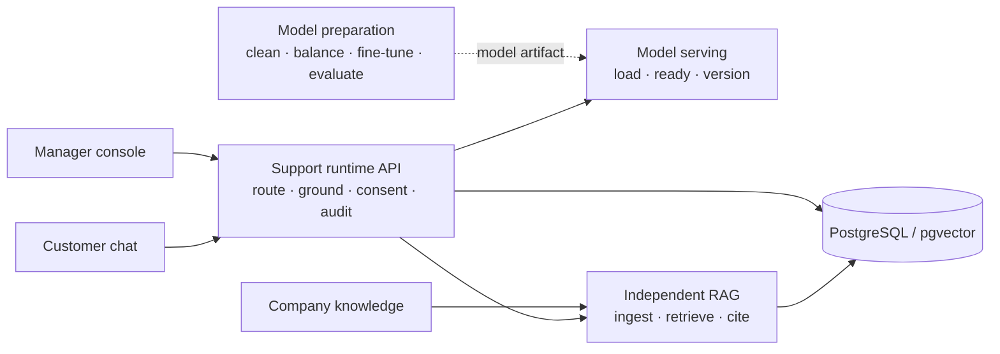

# Anonymous furniture company support AI

I built a customer-support assistant for an anonymous furniture company. About six weeks after launch, requests handled outside manager working hours increased by 15%, and requests closed without manager participation rose from approximately 5% to approximately 36%. The company also reported an increase in completed sales, but did not disclose a percentage. These are observed production outcomes; the public tree does not claim they came from the synthetic demo.

## What I built

The assistant answered company questions with citations, asked one focused clarification when needed, abstained when evidence was insufficient, and prepared a classified complaint after an explicit customer request or confirmation. It was English-first and did not place or edit orders, change inventory, accept payments, promise delivery or refund outcomes, or expose private data.

| Stage | Engineering problem | My work and evidence |
|---|---|---|
| Model preparation | Support examples mixed changing company facts with reusable behavior and needed leakage-safe evaluation. | Personally cleaned, balanced, split, and validated the corpus, then trained and evaluated a QLoRA fine-tune of Qwen3 4B. See the [model preparation component](components/01-model-preparation/README.md), [data lineage](components/01-model-preparation/docs/data-lineage.md), and [evaluation](components/01-model-preparation/docs/evaluation.md). |
| Model deployment | A trained artifact needs controlled loading, readiness, version identity, and a degraded path. | Deployed the model behind a provider boundary with manifest/checksum checks, readiness behavior, sampling settings, and explicit fallback handling. See the [model serving component](components/02-model-serving/README.md). |
| Independent RAG | Product facts change outside the model lifecycle and answers need traceable evidence. | Built ingestion, chunking, hybrid retrieval, reranking, index lifecycle, provenance, and citation validation. See the [RAG platform component](components/03-rag-platform/README.md). |
| API and app integration | Customer safety, complaint writes, and manager handoff need one auditable runtime boundary. | Integrated routing, grounded generation, bounded history, complaint consent/idempotency, persistence, audit, and manager handoff. The public tree includes reconstructed [customer chat](apps/customer-chat/README.md) and [manager console](apps/manager-console/README.md) clients for review. See the [support runtime component](components/04-support-runtime/README.md). |

The repository is one monorepo. The four components are ownership and interface boundaries; model preparation is a batch workflow that produces an artifact consumed by serving.




The [screenshot gallery](docs/screenshots/gallery.md) shows the cited answer, insufficient evidence, complaint confirmation, submitted complaint, manager queue, and degraded dependency states.

## Engineering decisions

I kept changing company facts in RAG and behavior policy in model preparation. Runtime owns orchestration and safety, so complaint submission is the only write-capable model-facing action and requires an explicit customer request or confirmation. I chose PostgreSQL/pgvector retrieval, structured decisions before grounded generation, bounded session memory, and independent app/model/index promotion because those choices keep evidence, state changes, and rollback boundaries explicit. The [architecture](docs/architecture/system-context.md) explains these tradeoffs.

## Public implementation scope

The public tree replaces production records, model weights, company documents, and the original interface with synthetic fixtures and a deterministic local provider. The demo validates service contracts and user journeys; production observations and current repository validation are kept in the [case study](docs/case-study/public-implementation.md) and [validation record](docs/evaluation/system/validation.md). Component metric profiles document definitions and evidence boundaries for [model preparation](components/01-model-preparation/docs/metric-profile.md), [serving](components/02-model-serving/docs/metric-profile.md), [RAG](components/03-rag-platform/docs/metric-profile.md), and [runtime](components/04-support-runtime/docs/metric-profile.md).

## Run the public demo

```bash
cp .env.example .env
docker compose up -d --build
docker compose run --rm seed
docker compose run --rm smoke
```

Then open [http://localhost](http://localhost). The public tree is a synthetic, deterministic reconstruction for portfolio review.

## Repository map

`contracts/` contains canonical cross-component schemas. `components/` owns implementation, fixtures, tests, and observability. `apps/` owns presentation. `infra/` and Compose assemble local services. Root `tests/` covers cross-boundary contracts and system journeys. Root `docs/` contains architecture, case study, evaluation, security, and screenshots.

Security and privacy boundaries are summarized in [security controls](docs/security/controls.md).

## License

MIT; see [LICENSE](LICENSE).
