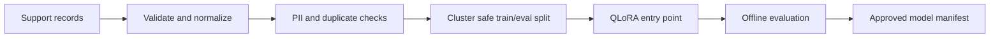

# 01 — Preparing the support model

This is the first stage of the production experience represented by the repository. I cleaned and balanced English support data, trained a QLoRA adapter for Qwen3 4B, and evaluated the resulting support behavior before handing an approved artifact to serving. The public repository reproduces the preparation workflow with a small synthetic fixture and inspectable configuration; production records, weights, and private documents are excluded.

The production corpus represented here contained 39,401 accepted English-primary records: 1,032 private, 31,234 public, and 7,135 teacher-generated. Those records are not in this repository. The checked-in 64-record fixture lets a reviewer inspect validation, balancing, split ownership, rendering, and artifact hashing without model downloads or a GPU.

The main implementation is in [`pipeline.py`](src/model_preparation/pipeline.py), with taxonomy and consent checks in [`records.py`](src/model_preparation/records.py), chat-example rendering in [`render.py`](src/model_preparation/render.py), and promotion hashes in [`artifacts.py`](src/model_preparation/artifacts.py). The leakage-safe split keeps near-duplicate conversations in one partition so evaluation cannot benefit from memorized variants. QLoRA keeps trainable memory focused on a small adapter while the base model remains frozen; the public config records that mechanical choice.

## What the stage receives and produces

It receives canonical JSONL records, the locked base-model reference, QLoRA settings, and an evaluation input. It produces normalized splits, a rejection report, `data-manifest.json`, rendered chat examples, resumable checkpoint metadata, and a manifest matching [`model-manifest.schema.json`](../../contracts/model-manifest.schema.json).

The normal path is CPU safe. GPU execution is an explicit operator action and fails closed when CUDA/BF16 or the optional training environment is absent. The fixture validator exits `2` when records are rejected, so bad input cannot silently become a training artifact.

For the report layout and the full preparation profile, see [training configuration and technical results](docs/metric-profile.md).

Read [data lineage](docs/data-lineage.md), [evaluation boundary](docs/evaluation.md), [QLoRA artifact and serving](docs/qlora.md), and the [QLoRA configuration](configs/qlora.yaml) for deeper parameters. The root workflow is [model-preparation.yml](../../.github/workflows/model-preparation.yml).

The next stage is [02 — serving an approved model](../02-model-serving/README.md).
