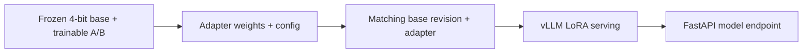

# QLoRA artifact and serving boundary

QLoRA combines a frozen base model loaded in 4-bit quantization with trainable
low-rank adapters. In the common NF4 setup, the base weights are quantized
for memory-efficient execution; the trainable matrices `A` and `B` carry the
task-specific update. The base parameters remain frozen during adapter
training.

The training output is an adapter directory containing adapter weights and
its configuration, plus metadata that identifies the exact base-model
revision and tokenizer. The adapter is not a standalone language model: it
only represents a delta to that base. Serving therefore needs the matching
base revision and loads the adapter on top of it. The GPU compose overlay's
`--enable-lora` and `--lora-modules` settings express that relationship; the
model manifest remains the artifact identity boundary.

The public preparation component contains a CPU-safe training smoke path and
records the production QLoRA choice in configuration. It does not download
private adapter weights or training data, and it does not claim that the smoke
path is a production PEFT run.
The underlying quantization and PEFT adapter relationship is described in the
[Hugging Face PEFT quantization guide](https://huggingface.co/docs/peft/developer_guides/quantization).

Optuna belongs at this stage as an offline hyperparameter-search layer: trials
can compare candidate training or evaluation configurations, after which a
selected artifact passes through the normal manifest and serving boundary. It
does not belong in the model request path. This repository describes that
extension point; it does not claim a historical Optuna run.
