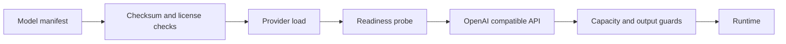

# 02 — Serving an approved model

This stage represents the deployment boundary I used after model preparation. It verifies an approved artifact, exposes a small versioned inference API, and keeps provider loading, readiness, sampling controls, and output safety in one place. The public path uses a deterministic mock so the repository is inspectable without private weights or a GPU.



[`providers.py`](src/model_serving/providers.py) defines the mock, vLLM, and external OpenAI-compatible adapters. [`service.py`](src/model_serving/service.py) validates the request, applies the controlled inference profile, rejects malformed or exhausted output, and exposes version identity. [`manifest.py`](src/model_serving/manifest.py) is the fail-closed artifact boundary; [`app.py`](src/model_serving/app.py) supplies the HTTP transport.

The service does not train, retrieve company knowledge, persist customer state, or submit complaints. The runtime calls it through [`model.openapi.yaml`](../../contracts/model.openapi.yaml). Production adapters require an approved manifest before startup. The default Compose provider is explicitly a simulator and its results are contract coverage, not model quality.

## Deployment path and configuration

[`configs/inference.yaml`](configs/inference.yaml) records non-thinking generation defaults: temperature `0.7`, top-k `20`, top-p `0.8`, min-p `0`, repetition penalty `1`, a 1,024-token completion budget, and the `<|im_end|>` stop sequence. The prompt budget is 7,168 tokens. The optional GPU overlay keeps vLLM behind this API and requires an operator-supplied immutable artifact and manifest; it does not claim a local GPU run.

The public deployment shape is a container running the FastAPI-compatible serving boundary in front of an OpenAI-compatible provider. The CPU Compose profile uses the deterministic provider. The GPU profile keeps the same API and swaps in vLLM with `--enable-lora`, an immutable base-model artifact, a matching LoRA adapter, BF16 execution, and an 8,192-token context. The checked-in overlay documents this vLLM path; it does not document an AWS-specific deployment, because the cloud account, networking, registry, and managed compute details are outside the public reconstruction.

The [serving profile](docs/metric-profile.md) records the illustrative metric definition and evidence boundary. [Rate limiting](docs/rate-limiting.md) describes the per-process API quota and its `429` response. The component workflow is [model-serving.yml](../../.github/workflows/model-serving.yml).

## Run and inspect

```bash
python -m pytest components/02-model-serving/tests -q
python -m ruff check components/02-model-serving/src components/02-model-serving/tests
```

The mock loads no weights. A real provider run requires the separately supplied model artifact, runtime, credentials, and hardware.

The next stage is [03 — building the company knowledge layer](../03-rag-platform/README.md).
