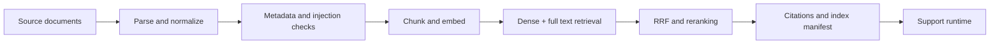

# 03 — Building the company knowledge layer

This stage represents the independent RAG platform I built around the support model. Its job is to turn changing company material into dated, permission-aware evidence that the assistant can cite. Keeping it separate from model serving made knowledge updates, rollback, provenance, and retrieval evaluation independently operable.

The implementation entry points are [`ingestion.py`](src/rag_platform/ingestion.py), [`chunking.py`](src/rag_platform/chunking.py), [`retrieval.py`](src/rag_platform/retrieval.py), and [`api.py`](src/rag_platform/api.py). PostgreSQL/pgvector lifecycle and the inactive-to-active promotion boundary live in [`postgres.py`](src/rag_platform/postgres.py) and [`seed.py`](src/rag_platform/seed.py). The public fixture contains 24 synthetic documents; production documents and the BGE artifacts are not included.

The local path uses a deterministic 768-dimensional feature-hash embedding named explicitly in [`embedding.py`](src/rag_platform/embedding.py). The production design uses a pinned BGE embedding and reranker contract, but the local vector is not BGE inference. Retrieval applies workspace, audience, language, and validity dates before dense and PostgreSQL full-text candidates are fused with RRF `k=60`; evidence is reranked, budgeted, and returned with stable citation IDs.

## Index lifecycle and behavior

The ingestor validates source lineage, writes an inactive version, verifies its manifest, and activates it atomically. The API reads through a separate role. Missing or stale evidence produces `insufficient_evidence`; dependency failure is surfaced to runtime as temporary unverifiability. Indexed text is data, never an instruction source.

The public Compose path exercises this boundary with synthetic data and pgvector. The [synthetic benchmark](docs/evaluation/public-synthetic-benchmark.md) and root [RAG contract](../../contracts/retrieval.openapi.yaml) describe the public evidence boundary. The component workflow is [rag-platform.yml](../../.github/workflows/rag-platform.yml).

For the report layout and retrieval profile, see [technical results](docs/metric-profile.md).

The source fixture, retrieval golden set, migrations, manifests, and dashboards are kept here so a reviewer can follow the path from document to cited answer.

The next stage is [04 — integrating the support experience](../04-support-runtime/README.md).
