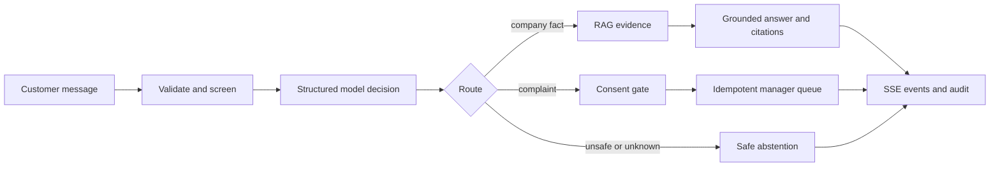

# 04 — Integrating the support experience

This is the request boundary where I brought the prepared model and independent RAG service together. It owns the customer conversation, safety policy, bounded history, citation checks, complaint consent, persistence, and manager handoff. The result is a support workflow that can answer documented questions while refusing to invent company policy or perform order transactions.

The orchestration entry point is [`service.py`](src/support_runtime/service.py), with API/session behavior in [`api.py`](src/support_runtime/api.py), policy checks in [`validation.py`](src/support_runtime/validation.py) and [`guardrails.py`](src/support_runtime/guardrails.py), and persistence in [`postgres.py`](src/support_runtime/postgres.py) and [`storage.py`](src/support_runtime/storage.py). The public API follows [`chat.openapi.yaml`](../../contracts/chat.openapi.yaml); canonical decisions, complaints, and events live under [`contracts`](../../contracts/).

The runtime calls model serving and RAG only through HTTP contracts. It never lets the model choose identity, timestamps, roles, or the complaint idempotency key. Inferred dissatisfaction creates a confirmation draft; only explicit consent in the current message can submit directly. RAG outage, insufficient evidence, model outage, and failed complaint writes each have a distinct client-safe outcome.

## Conversation and manager workflow

History is bounded to eight recent turns and an approximate 2,400-token budget. Customer and manager identity are signed HTTP-only cookies, with optional fixed-role machine access. PostgreSQL stores conversations, complaints, audit events, and outbox records; SQLite is the dependency-light reference used by tests. The runtime emits a replayable SSE event envelope. The public simulator returns a complete answer and then emits post-computed chunks, so this repository demonstrates the event contract rather than upstream token streaming.

Security controls, citation validation, dependency outcomes, and complaint persistence are summarized in the component metric profile and root [security controls](../../docs/security/controls.md). The component workflow is [support-runtime.yml](../../.github/workflows/support-runtime.yml).

For the report layout and integrated runtime profile, see [technical results](docs/metric-profile.md).

The owned fixtures and tests make the routing, safety, citation, consent, idempotency, and degraded dependency behavior inspectable without production credentials.

The presentation clients for this workflow are [customer chat](../../apps/customer-chat/README.md) and [manager console](../../apps/manager-console/README.md).
