# Screenshot gallery

All images show deterministic synthetic states of the public portfolio interface; no production UI or customer data is shown. They are visual previews for reviewers who do not run the stack, while the same states remain available from the fixture selectors in the local interfaces.

| State | Desktop | Mobile |
|---|---|---|
| Catalog answer with two citations | 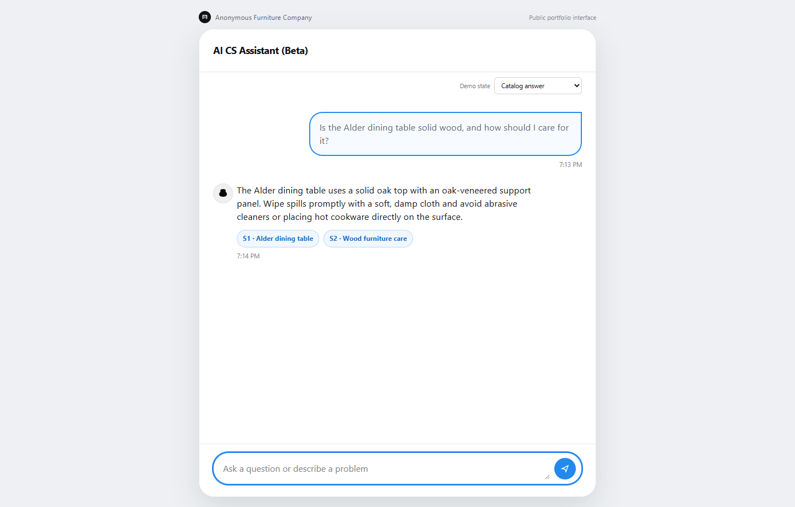 | 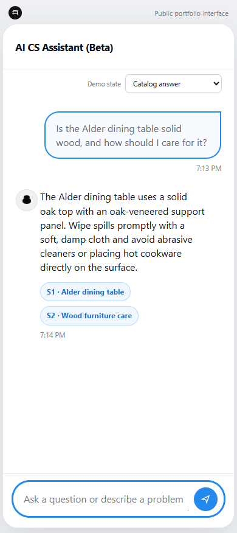 |
| Insufficient evidence | 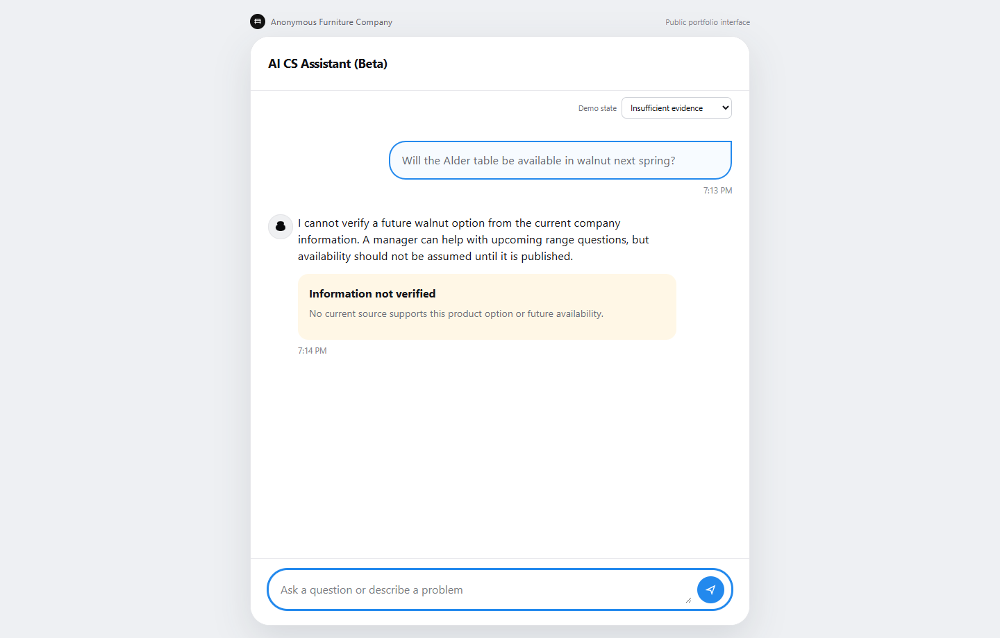 | 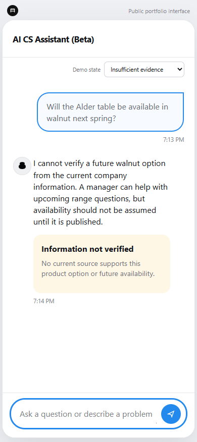 |
| Ambiguous complaint confirmation | 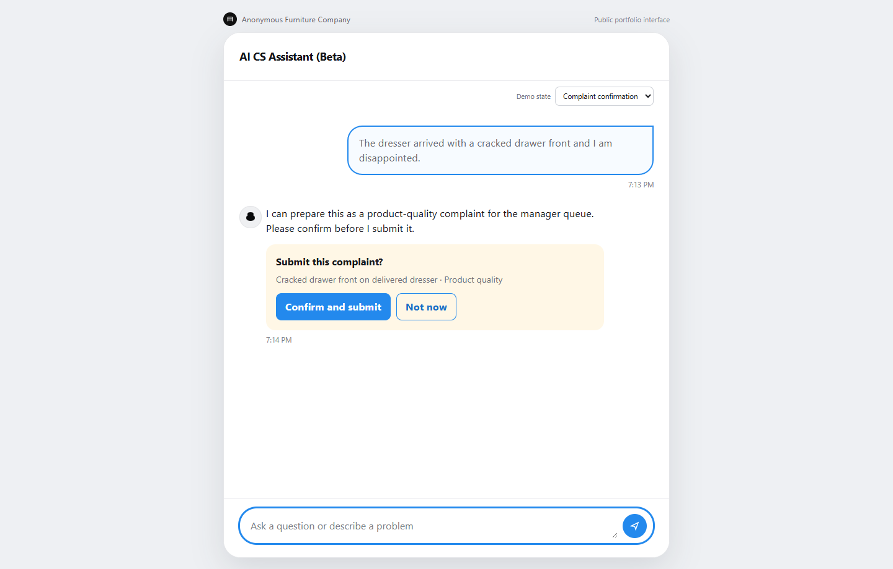 | 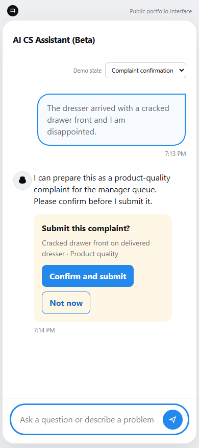 |
| Explicit complaint submitted | 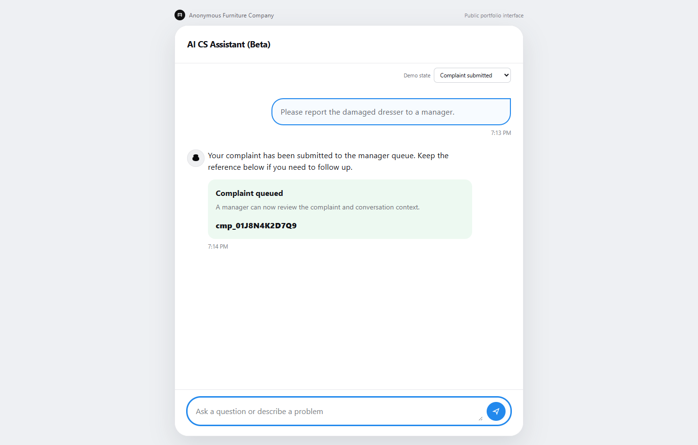 | 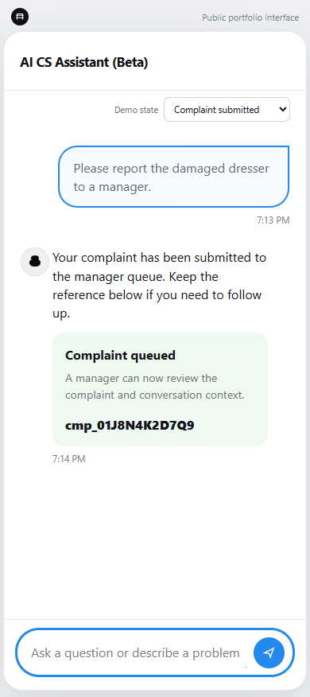 |
| Manager complaint queue | 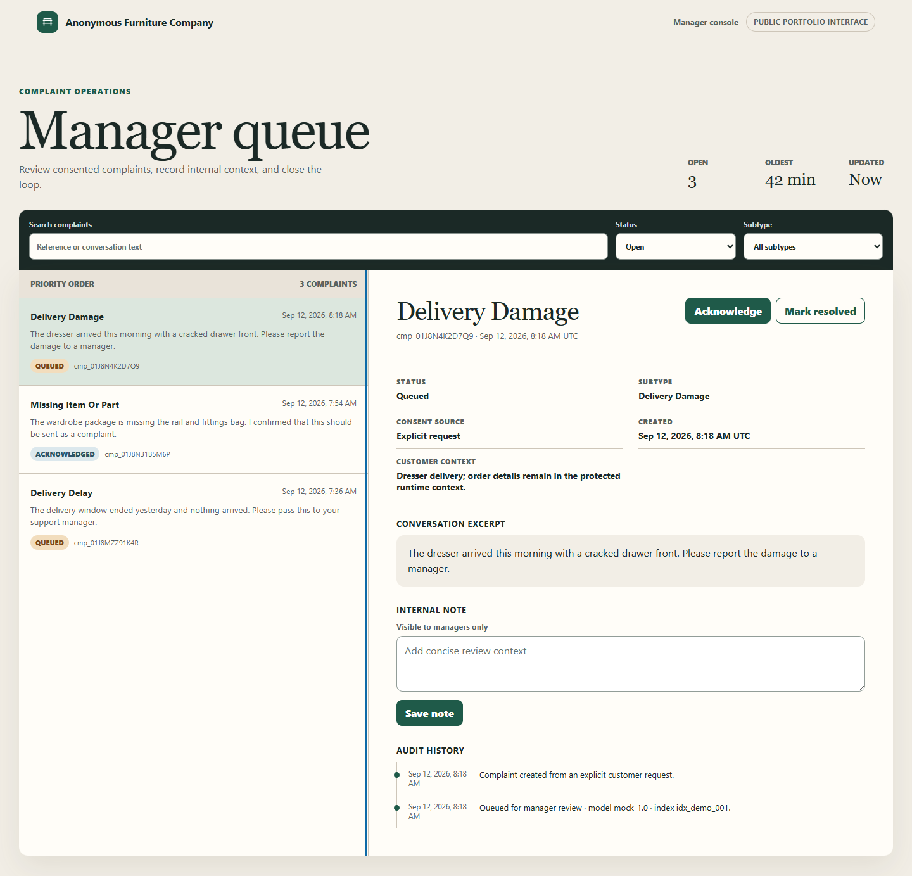 | 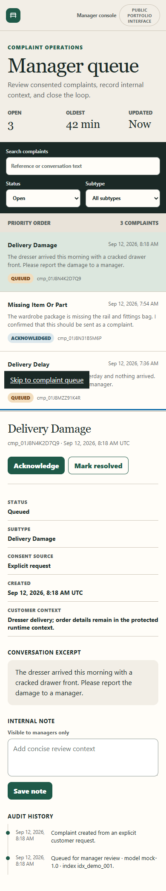 |
| Degraded dependency response | 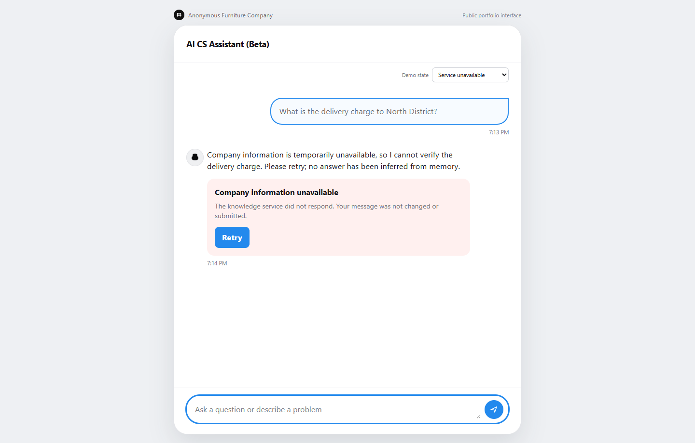 | 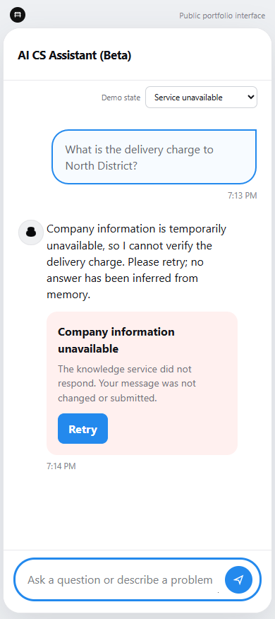 |
